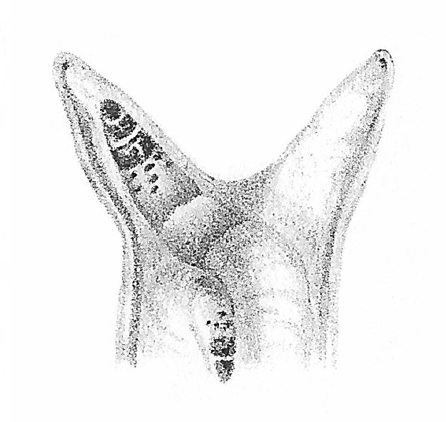

# snail [![Build Status][travis-img]][travis] [![Crates.io][crates-img]][crates]

[travis-img]:   https://travis-ci.org/kpcyrd/snail.svg?branch=master
[travis]:       https://travis-ci.org/kpcyrd/snail
[crates-img]:   https://img.shields.io/crates/v/snail.svg
[crates]:       https://crates.io/crates/snail

**Disclaimer:** The project is in a very early state, you're very likely to
experience bugs. I'm using it as my daily driver, but you should expect a very
bare bone experience if you're considering doing the same.

Parasitic network manager. snail is trying to fill the gap of a metasploit-like
network manager. Its core feature is a scripting engine that can be used to
match known networks and also interact with captive portals if one is
discovered. Have a look at the [scripts/](scripts/) folder for examples. The
basic idea is that you're trying to get connectivity, but you don't really care
where it's actually coming from. Please remain seated and keep your arms and
legs inside the firewall at all times.



## Installation

If possible, use the [snail-git] package for archlinux. For a manual setup on a
debian based system, install the dependency libraries `libseccomp-dev`,
`libdbus-1-dev` and `libzmq3-dev`.

[snail-git]: https://aur.archlinux.org/packages/snail-git/

Next, build the binary:
```
cargo build --release
```

And install it:
```
install -Dm755 target/release/snail{d,ctl} /usr/bin
install -Dm644 scripts/* -t /usr/lib/snaild/scripts

install -d /etc/snail/scripts
install -Dm644 contrib/snail.conf -t /etc/snail
install -Dm644 contrib/snail@.service -t /usr/lib/systemd/system
install -Dm644 contrib/snail-tmpfiles.conf /usr/lib/tmpfiles.d/snail.conf
install -Dm644 contrib/snail-sysuser.conf /usr/lib/sysusers.d/snail.conf

systemd-tmpfiles --create
systemd-sysusers
systemctl daemon-reload
systemctl enable --now snail@wlp3s0
```

You can monitor your network status with snailctl. Make sure your user is in
the correct group which is specified in /etc/snail/snail.conf.
```
snailctl status
```

To add yourself to the correct group, run
```
usermod -aG snail user
```

## snailctl decap

The captive portal engine should run automatically as part of snaild, but it's
also possible to invoke it manually.

To execute the engine in verbose mode, run:
```
snailctl decap -v
```

Some portals also hijack the android captive portal probe, in that case you can
bypass the captive portal test and execute the scripts directly by running:
```
snailctl decap -vf
```

If you are developing a new script, you can provide the path to that script
using:
```
snailctl decap -v ~/scripts/foo.lua
```

By default, custom scripts are loaded from `/etc/snail/scripts/*.lua`, but you
can also add additional folders to `/etc/snail/snail.conf`:
```
[scripts.paths."/home/user/snail/scripts"]
[scripts.paths."/opt/snail/scripts"]
```

To ensure your script is properly being picked up, run snailctl without any
arguments:
```
snailctl
```

If you wrote a new script for a captive portal, please submit a pull request.

## snaild dns

snaild contains a dns server that listens for dns queries on localhost and
forwards them to a dns-over-https recursor. You can also configure your own
zones that get forwarded to a different dns recursor, or hardcode static dns
records.

```toml
[dns]
bind = "127.0.0.1:53"

# cloudflare
servers = ["1.1.1.1",
           "1.0.0.1",
           "2606:4700:4700::1111",
           "2606:4700:4700::1001"]
port = 443
sni = "cloudflare-dns.com"

[dns.records]
"foo.example.com" = ["192.0.2.10", "2001:DB8::10"]
"bar.example.com" = ["192.0.2.20", "2001:DB8::20"]

[dns.zones]
"example.com" = ["192.0.2.2", "2001:DB8::2"]
"corp.example.com" = ["192.0.2.3", "2001:DB8::3"]
```

## snaild vpn

:fire::fire::fire: **Highly experimental, use at your own risk** :fire::fire::fire:

snaild contains a vpn server and client that can be used to setup an encrypted
tunnel to a remote server. It features forward secrecy, identity hiding for the
client and is going to support various transport channels in the future to
evade egress firewalls.

The encrypted tunnel is setup using the noise protocol with
`Noise_XK_25519_ChaChaPoly_BLAKE2s`. Unlike some traditional vpn clients, we do
not leak any metadata during the handshake.

To setup the server, run `snaild vpn-keygen` to generate a keypair for the
server. You also need to specify a range for the client ip pool and list the
public keys of all clients that are authorized to connect to the server.

```toml
[vpn.server]
bind = "0.0.0.0:443"

server_pubkey = "s0c8xxxxxxxxxxxxxxxxxxxxxxxxxxxxxxxxxxxx4D0="
server_privkey = "a0zxxxxxxxxxxxxxxxxxxxxxxxxxxxxxxxxxxxxQg5o="

gateway_ip = "192.168.100.1/24"
pool_start = "192.168.100.5"
pool_end = "192.168.100.200"

clients = [
    "cn66xxxxxxxxxxxxxxxxxxxxxxxxxxxxxxxxxxxxaXY=",
]
```

Next, use `snaild vpn-keygen` again and generate a key for the client. Copy the
private key you generated into the client section together with the public key
you generated for the server.

```toml
[vpn.client]
remote = "192.0.2.13:443"

server_pubkey = "s0c8xxxxxxxxxxxxxxxxxxxxxxxxxxxxxxxxxxxx4D0="
client_privkey = "te4Pxxxxxxxxxxxxxxxxxxxxxxxxxxxxxxxxxxx4Qx8="
```

Starting the vpn on both the server and client should give you an encrypted
tunnel between both:

```
server# snaild vpnd snail0
client# snaild vpn snail1
```

## Trivia

The name snailctl is inspired by [Leucochloridium], a parasite that lives
inside a snail and is able to control its host. In the long term, `snaild` is
the process that interfaces with the snails brain and `snailctl` is the utility
to control the snail through `snaild`.

The logo has been created by Baudon in 1879.

[Leucochloridium]: https://en.wikipedia.org/wiki/Leucochloridium

## License

GPLv3+
