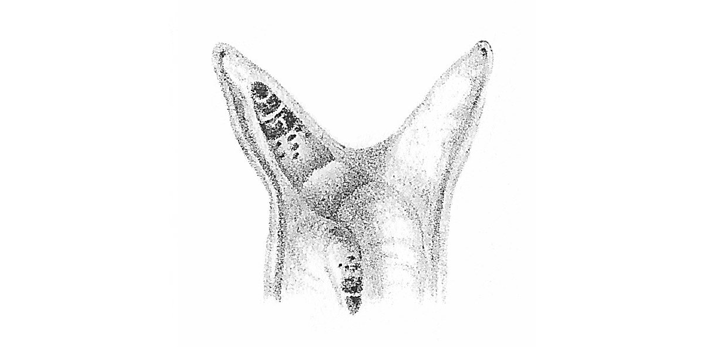

# snail

Parasitic network manager.

## Trivia

The name snailctl is inspired by [Leucochloridium], a parasite that lives
inside a snail and is able to control its host. In the long term, `snaild` is
the process that interfaces with the snails brain and `snailctl` is the utility
to control the snail through `snaild`.

The logo has been created by Baudon in 1879.

[Leucochloridium]: https://en.wikipedia.org/wiki/Leucochloridium

## License

GPLv3+
